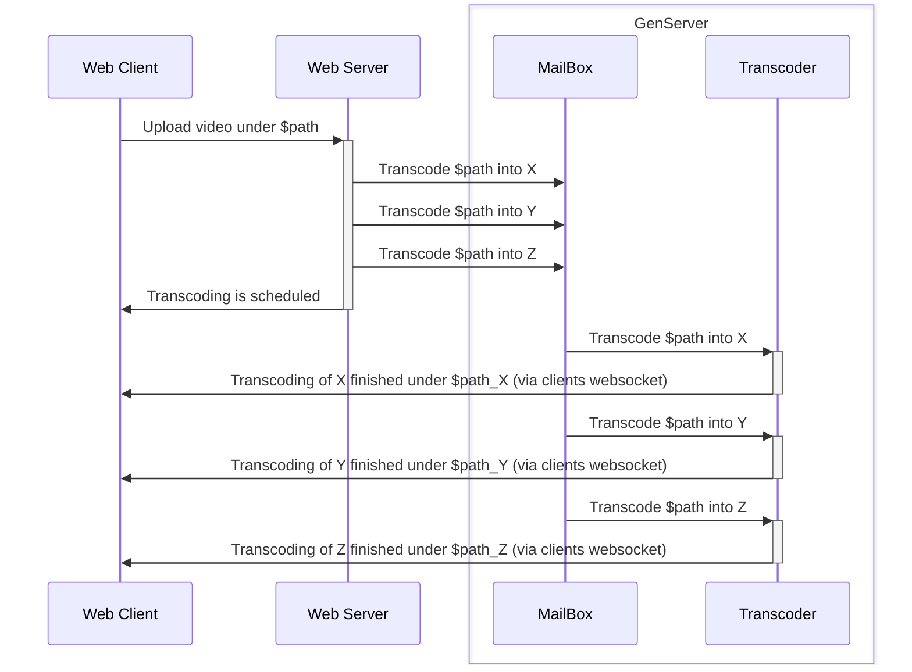

## Introduction

Introduction on what is Elixir and how you could consume the language.
First of all we'll walk together through the Elixir basics, and then, to solidify our knowledge, we'll implement a project that is relatively difficult in other languages but remarkably simple in Elixir.

## First steps

### Elixir

- First install livebook locally (https://livebook.dev/)
- This livebook should help you get an overview of Elixir:

- More detailed explanation regarding moving pieces in Elixir can be found in [Elixir Docs](https://hexdocs.pm/elixir/introduction.html)

### Phoenix

https://hexdocs.pm/phoenix/overview.html

### Phoenix live view

https://hexdocs.pm/phoenix_live_view/welcome.html

### OTP

https://serokell.io/blog/elixir-otp-guide

## Project details

### General description

As a result of the project, we’d want to create a page that will allow us to upload a video file and get 3 versions of that video in 3 different qualities (let’s say 360p, 480p, and 720p).
Those videos should be playable as soon as the transcoding process finishes. (It means that the server should process them async, and send back as soon as they are ready).

### Suggested steps we break it into

1. Project setup. (We suggest using Phoenix and LiveView, but you can use whichever elixir tool you find useful). See [`mix phx.new command`](https://hexdocs.pm/phoenix/Mix.Tasks.Phx.New.html), and useful `--no-ecto` option, as we don’t need to persist the videos.
1. Create uploading form (see https://hexdocs.pm/phoenix_live_view/uploads.html)
1. Transcode the uploaded video ([GenServer](https://hexdocs.pm/elixir/1.17.1/GenServer.html) will be helpful here) and send back the video to the client (ffmpeg runned using System.cmd/3 could be helpful, [ffmpeg installation](https://phoenixnap.com/kb/ffmpeg-mac))
1. Add different types of notifications to the client. Say when the video is started to be transcoded, the client sees a banner saying your video is picked by our “transcoder”, when it is processed the client receives an update and sees the newly processed video.

Depending on the time you have, you can do only the first few steps, ignoring 3 and 4.

### Flow diagram

## Suggested way of collaborating

- You can create a repo with a project (public or private, whichever works best for you) and request my (@dimamik) reviews of the Pull Requests which should be atomic sensible parts your project is split into.

- Please, commit the initial `mix new ...` run separately so we know which changes are generated, and which are yours.

- Break down your work into medium-sized pieces, so you get your feedback faster.

## Advanced version of the project - YouTube in LiveView -> LiveTube

In more advanced version of the project we will be building a YouTube alternative, which primary functionalities will include:

- User auth flow
- User private video library. Some of the videos can be marked as public, then they can be watched by others.
- The ability to watch your own videos in different qualities (it's okay to pre-generate and save 3 of the main ones).
- The ability to subscribe to other folks and watch their public videos.
- Subscribed feed, where the videos from folks you subscibe is presented.
- General feed, where both videos from floks you subscibe are mixed with videos from the folks you don't (no recommendation algorithm for now, just random videos)
- Real-time watch count (watch counts as soon as somebody loaded the video, only one per registered user). Unregistered users can't watch videos.
- Video Comments & likes

And if you're still not busy enough, then:

1. Instead of streaming from the file, use HLS to deliver videos.
1. Instead of randomly selecting the content to the feed, use recommendation algorithm of a choice to create magnificent YouTube-like (or even better) feed. Consider using [NX](https://github.com/elixir-nx/nx) and [Axon](https://hexdocs.pm/axon/Axon.html) to adapt some recommendation model to [Bumblebee](https://github.com/elixir-nx/bumblebee).
